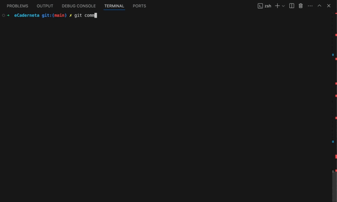
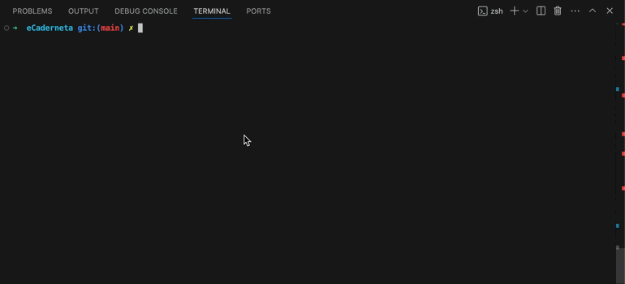
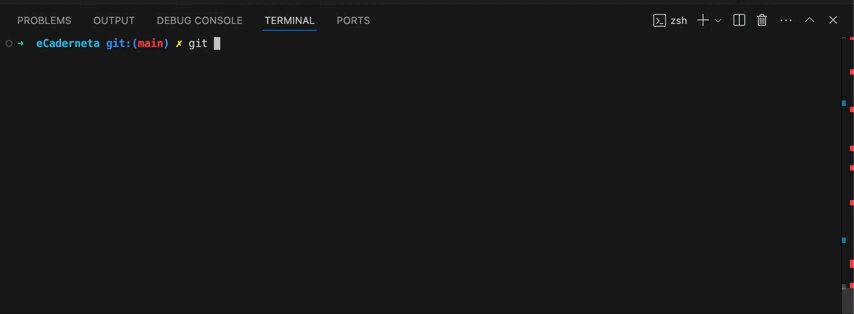

# Anto - UNDER DEVELOPMENT - DO NOT USE IT YET
Simplifying Git Project Organization and Code Quality


## Overview

Anto is designed to ease the burden of code reviews, project integration, project documentation and maintaining code quality.

We believe that code reviews should focus on functionality, rather than commit message formats, project structure, or simple file rules.

Anto provides an easy way to validate commit messages, project structure (files and folders), and file content using [VSK/MSK](./vsk_msk_structure.md) files, combined with [Git hooks](https://git-scm.com/book/ms/v2/Customizing-Git-Git-Hooks).

On top of that Anto is the best way to write a technical documentation, because it ensures up-to-date and well written documentation. 

We believe that **It's a game changer!** for all kind of projects, from open source, to big corporation software.

## How It Works

**Validation on commit**: every time that a commit occurs, anto will validate all the rules defined in the .vsk and .msk files under the .anto directory, this is made possible by creating a commit-msg [Git hook](https://git-scm.com/book/ms/v2/Customizing-Git-Git-Hooks).
  - *Folder Structure Validation*: Ensures the folder structure follows predefined rules.
  - *File Content Validation*: Validates specific content inside project files.
  - *Commit Validation*: Ensures commit messages follow the predefined rules.
  - *Documentation*: Ensures the project has a proper documentation, because it forces the project to describe each file and folder.

## Donate - Support Development
To help Anto growth please donate using [patreon](https://www.patreon.com/MJAZ) or [KoFi](https://ko-fi.com/afonsomatlhombe).

## Features

### Commit Message Validation (`.anto/commit.msk`)



Commit message validation works by defining rules (regex and max lines) in the `.anto/commit.msk` file:

```
/*
Commits should follow the Conventional Commits structure:

[optional scope]: <description>

Allowed types:
- feat: A new feature
- fix: A bug fix

Commit messages should not contain the word 'commit' and must be a maximum of 300 characters.
*/

l 300 <

+ feat:*
+ fix:*

- commit*
```
For more details about `.msk` files, see the [VSK/MSK](#vskmskfiles) section.

### Project Structure Validation (`.anto/validation.vsk`)



The project structure validation is defined through rules for files and folders in the `.anto/structure.vsk` file:

```plaintext
[app]
    [src]
        [main]
            [java]
                [anto]
                    [feature]
                        # Matches files that end with 'utils.6', must be 1 to 5 files
                        {*utils.6} 1..5
                    # Matches 'ui' directory   
                    [ui]   
                    # Matches 'utils' directory         
                    [utils]
        [test]
            # Must have maximum 5 features
            [feature-*] < 5
                {*utils.6}
    [build]
        # Matches all files and folders recursively (useful for ignoring entire directories)
        [**]   
[commit]
    # Matches files like 'commit.log', 'commit.txt', etc.
    {commit.*} 
```

You can generate the `validation.vsk` file for your project with this command:

```bash
.anto create-validation
```

### File Content Validation (`.anto/{projectName/*/*.vsk}`)



File content validation is based on rules defined for specific files within your project. Create directories and files (with the `.msk` extension) that mirror your project structure inside the `.anto` folder.

To automate this, use the following command to create your project folder and file structure:

```bash
.anto create-structure
```

Example of an `.msk` file for `MainActivity.kt`:

```plaintext
/*
The MainActivity.kt file should only contain navigation code and must not include any @Composable annotations.

The file should be a maximum of 300 lines to prevent overly large classes.
*/

# must have 300 lines max
l 300 < 

# the class name must contain Activity
+ *Activity 

# the activity shouldnot contain any composable
- @Composable* 
```

## Installation

### Prerequisites

Before getting started, ensure you have:

- Git installed.
- Removed temporary folders and files (e.g., node_modules, build).
- Remove .anto folder if exists.

### Fast Installation

In the root of your .git project run the following command:

#### Mac

```bash
/bin/bash -c "$(curl -fsSL https://raw.githubusercontent.com/MJAZ93/anto/main/build/remote-mac.sh)"
```

#### Linux

```bash
/bin/bash -c "$(curl -fsSL https://raw.githubusercontent.com/MJAZ93/anto/main/build/remote-linux.sh)"
```

#### Windows

```bash
Invoke-WebRequest -Uri "https://raw.githubusercontent.com/MJAZ93/anto/main/build/remote-windows.ps1" -OutFile "$env:TEMP
emote-windows.ps1"; & "$env:TEMP
emote-windows.ps1"
```

### [Step by Step installation](./step-by-step-installation.md)

### Checkout a project containing Anto

If you are checking out a project that already includes Anto, you will need to run the following command to activate it. This command will only add the commit-msg hook:

*mac and linux*:  
```bash
   ./.anto/anto add-precommit
```

*windows (navigate to .anto folder and)*:
```powershell
   .\anto.ps1 add-precommit
```

### Skipping

You can always skip the validation by adding the flag *--no-verify* when committing code.

## Testing
Just make a commit and **anto** will ensure to make the all validations.

[screenshot-gif]

## Additional Validation

You can extend the commit-msg hook by adding custom steps. For example, you can include other scripts (tests, linters) in `validations.sh` (for Mac and Linux) or `validation.ps1` (for Windows):

```bash
#!/bin/sh
./anto validate

# goes to the root of the project
cd ..
# Additional scripts (e.g., tests, linters)
lint
gradle test
```

## Licence
Anto is under the [Fair Code Licence](https://faircode.io/).

